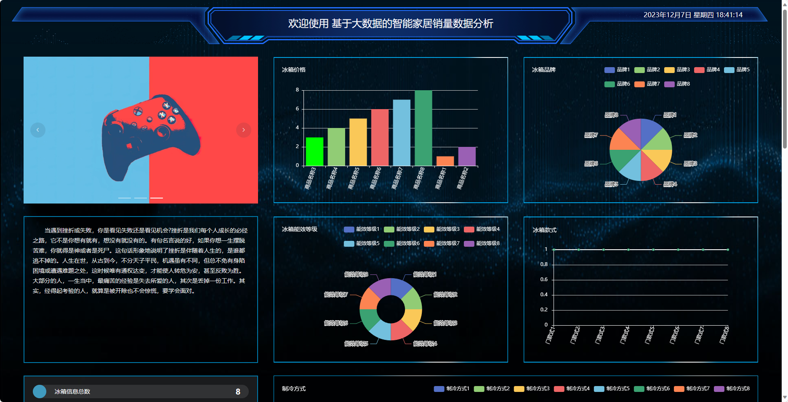
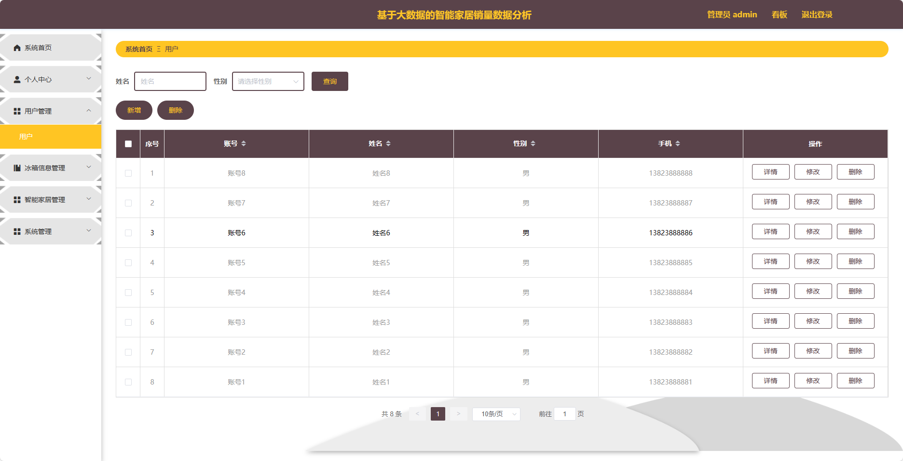
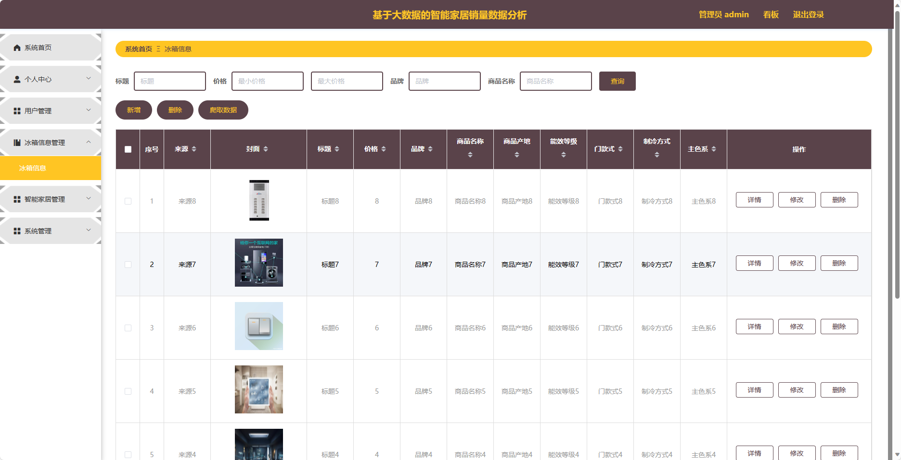
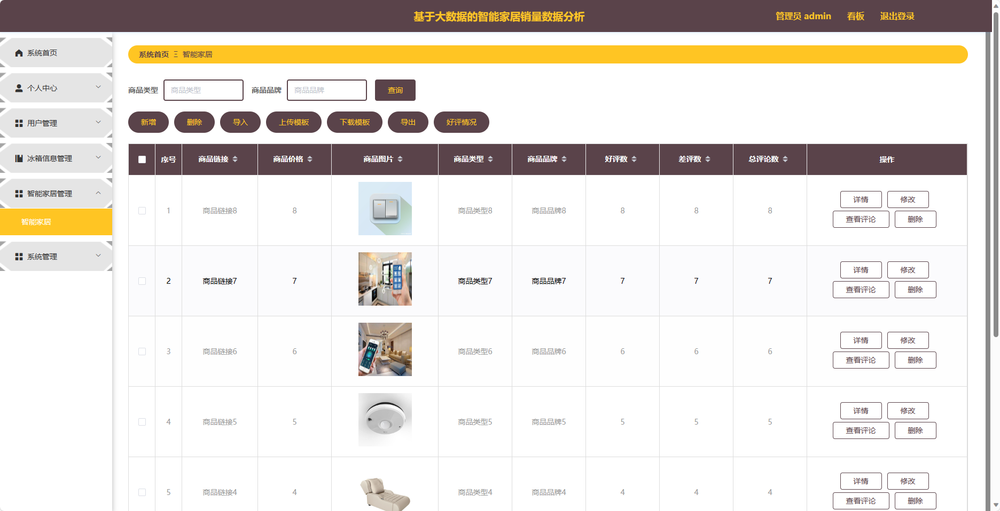
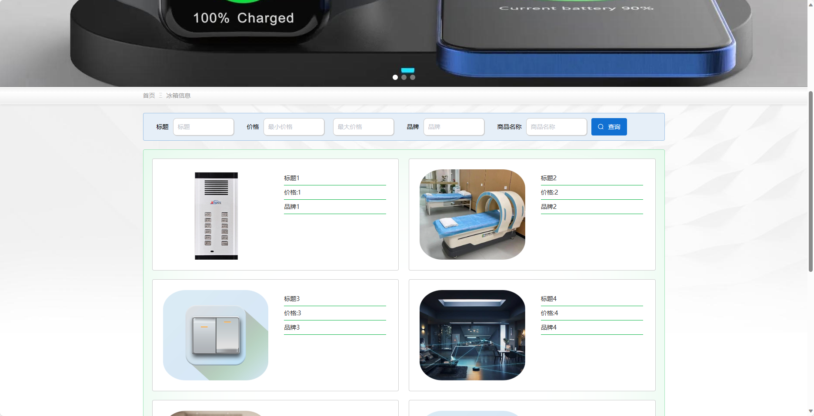
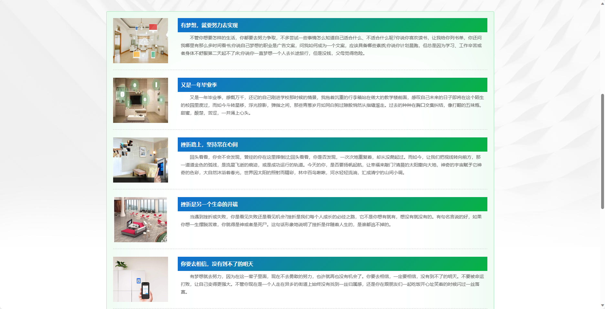

## 基于大数据的智能家居销量数据分析

###  获取sql数据库文件: 从戎源码网 (https://armycodes.com/) QQ: 386869957 QQ群: 377586148
###  所有系统地址: (https://github.com/YuLin-Coder/AllProjectCatalog) 
###  所有项目以及源代码本人均调试运行无问题 可支持远程安装部署调试、定制修改、代码讲解

## 项目介绍
基于大数据的智能家居销量数据分析，系统包含两种角色：管理员、用户,系统分为前台和后台两大模块，主要功能如下。

### 【管理员】:
1. 系统首页：展示系统的概览信息和数据统计。
2. 个人中心：管理员可以管理个人信息，包括修改密码等操作。
3. 用户管理：管理员可以管理用户信息，包括查看用户列表、禁用用户等操作。
4. 冰箱信息管理：管理员可以管理冰箱产品的信息，包括添加、编辑、删除等操作。
5. 智能家居管理：管理员可以管理智能家居产品的信息，包括添加、编辑、删除等操作。
6. 系统管理：管理员可以管理系统的参数设置、日志查看等功能。

### 【前台】:
1. 首页：展示智能家居产品的最新信息和推荐内容。
2. 冰箱信息：提供冰箱产品的详细信息和特点介绍。
3. 智能家居：展示智能家居产品的种类、功能等信息。
4. 智能家居资讯：提供智能家居行业的最新资讯和动态。
5. 个人中心：用户可以管理个人信息，包括修改密码、查看订单历史等操作。

## 项目技术
- 编程语言：Java
- 数据库：MySQL
- 项目管理工具：Maven
- 前端技术：HTML、CSS、JavaScript、Jquery、Vue
- 后端技术：Spring、SpringMVC、MyBatis

## 运行环境
- JDK版本：JDK1.8及以上
- 开发工具：IDEA、Ecplise、Myecplise都可以
- 数据库: MySQL5.7及以上
- Maven：maven3.0及以上
- Node：14.14.0及以上

## 运行截图

